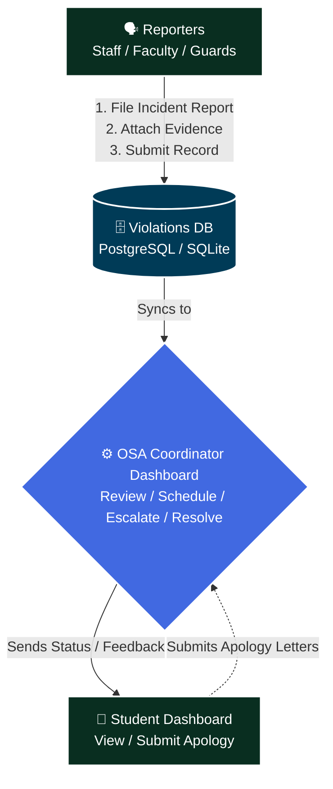
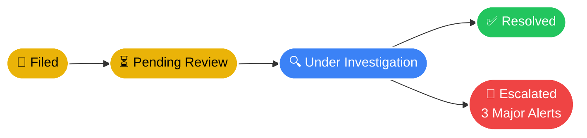

# 🛡️ CHMSU Student Violation Monitoring System

> **A Django-based web application that automates student discipline tracking, violation workflows, and OSA coordination for CHMSU Talisay Campus.**


---

## 📋 Table of Contents

- [Overview](#-overview)
- [Objectives](#-objectives)
- [Core Features](#-core-features)
- [System Architecture](#-system-architecture)
- [User Roles](#-user-roles)
- [Tech Stack](#-tech-stack)
- [Setup & Installation](#-setup--installation)
- [Usage](#-usage)
- [API Endpoints](#-api-endpoints)
- [UI Snapshots](#️-ui-snapshots)
- [Configuration & Security](#️-configuration--security)
- [Project Structure](#-project-structure)
- [About](#-about)
- [License](#-license)

---

## 🔍 Overview

Managing student discipline manually across a campus is slow, inconsistent, and difficult to track over time. The **CHMSU Student Violation Monitoring System** is a full-stack Django web application that digitizes and automates the entire student discipline lifecycle for CHMSU Talisay Campus.

From the moment an incident is reported, the system routes it through a structured workflow:

1. **Report** — Staff, Faculty, or Guards file incidents with evidence attachments
2. **Track** — Violations are categorized (minor/major) and assigned a status lifecycle
3. **Coordinate** — The OSA Coordinator reviews cases, schedules meetings, and verifies apology letters
4. **Alert** — Automatic escalation when a student accumulates **3 effective major violations**
5. **Audit** — Every action is logged for activity and login auditing

The result: a transparent, consistent, and accountable discipline system across all user roles.

---

## 🎯 Objectives

| Goal | Description |
|---|---|
| 📁 **Centralize Records** | Replace paper-based violation tracking with a unified digital system |
| 🔔 **Automate Escalation** | Trigger alerts automatically when disciplinary thresholds are reached |
| 🔄 **Streamline Workflows** | Guide incidents through a structured lifecycle from report to resolution |
| 🧾 **Ensure Accountability** | Log all activity and enforce role-based access for every user type |
| 📷 **Biometric Integration** | Provide face-detection and TTS APIs for attendance and welcome workflows |

---

## ✨ Core Features

### 👔 For OSA Coordinators / Admins
- **Violation Dashboard** — View all active, pending, and resolved cases in one place
- **Case Management** — Update violation status through the full lifecycle
- **Meeting Scheduler** — Schedule disciplinary hearings directly from the system
- **Apology Letter Verification** — Review and approve student-submitted apology letters
- **Threshold Alerts** — Get notified when a student reaches 3 effective major violations
- **Themed Admin UI** — Powered by `django-jazzmin` for a modern admin experience

### 👤 For Students
- **Personal Dashboard** — View your own violation history and current status
- **Apology Letter Submission** — Upload apology letters for formator review
- **8-Digit Student ID Login** — Secure, institution-specific authentication flow
- **Profile Management** — Manage profile photo and personal information

### 🏫 For Staff / Faculty / Guards
- **Incident Reporting** — File violations with evidence attachments and descriptions
- **Role-Specific Dashboards** — Each user type sees a tailored view of their responsibilities
- **Overdue Monitoring** — Utility script to surface violations unresolved for 7+ days

### ⚙️ System Capabilities
- Role-based accounts: `Student`, `Staff`, `OSA Coordinator`, `Guard`, `Formator Head`
- Custom `User` model with 8-digit student ID validation
- Minor / Major violation categorization with full status lifecycle
- Document & evidence file attachments (stored under `media/`)
- Activity and login auditing across all roles
- Face-detection API (`/api/detect-face/`) via OpenCV
- Server-side Text-to-Speech API (`/api/welcome-tts/`) via gTTS
- Dual-database support: PostgreSQL (production) or SQLite (development)

---

## 🏗️ System Architecture

### Overall Flow



### Violation Lifecycle



---

## 👥 User Roles

| Role | Login URL | Access Level |
|---|---|---|
| **Student** | `/student/` | View own violations, submit apology letters |
| **Staff** | `/staff/` | File violations, view staff dashboard |
| **OSA Coordinator** | `/faculty/` | Full case management, meetings, approvals |
| **Guard** | `/staff/` | File incidents at entry/exit points |
| **Formator Head** | `/staff/` | Verify apology letters from assigned students |
| **Admin (Superuser)** | `/admin/` | Full system access via Django Admin |

> To promote a user to OSA Coordinator: **Django Admin → Users → select user → set `is_staff = True`**

---

## 🛠️ Tech Stack

| Layer | Technology |
|---|---|
| **Web Framework** | Django 5.2.7 |
| **Language** | Python 3.11+ |
| **Database (Production)** | PostgreSQL 16 (`psycopg[binary]`) |
| **Database (Development)** | SQLite 3 (via `USE_SQLITE` env var) |
| **Admin UI Theme** | django-jazzmin 3.0.1 |
| **Computer Vision** | OpenCV 4.10 + NumPy 2.2 |
| **Text-to-Speech** | gTTS 2.5 |
| **Image Handling** | Pillow 12.0 |
| **Static Files** | WhiteNoise 6.8 |
| **Production Server** | Gunicorn 23.0 |
| **WebSockets (optional)** | Django Channels 4.3 |

---

## 🚀 Setup & Installation

> 💡 For a detailed Windows setup walkthrough, see **[INSTRUCTIONS.md](INSTRUCTIONS.md)**.

### Prerequisites

- Python **3.11+**
- pip
- Git
- PostgreSQL *(optional — SQLite works for local dev)*

### Quick Start

**1. Clone the repository**
```bash
git clone <repository-url>
cd syande
```

**2. Create and activate a virtual environment**
```powershell
# Windows (PowerShell)
python -m venv virtualenv
.\virtualenv\Scripts\Activate
```
```bash
# macOS / Linux
python3 -m venv virtualenv
source virtualenv/bin/activate
```

**3. Install dependencies**
```bash
pip install -r requirements.txt
```

**4. Configure the database**

For local development with SQLite *(no PostgreSQL needed)*:
```powershell
# PowerShell
$env:USE_SQLITE = "True"
```
```cmd
:: CMD
set USE_SQLITE=True
```

For PostgreSQL, update `DATABASES` in `student_violation_system/settings.py` or set environment variables. The default config expects a local `postgres` user with password `1234`.

**5. Run database migrations**
```bash
python manage.py migrate
```

**6. Create a superuser (OSA Admin)**
```bash
python manage.py createsuperuser
```

**7. (Optional) Collect static files**
```bash
python manage.py collectstatic --noinput
```

**8. Start the development server**
```bash
python manage.py runserver
```

The application will be available at **http://127.0.0.1:8000/**  
Django Admin panel: **http://127.0.0.1:8000/admin/**

---

## 📖 Usage

### OSA Coordinator Workflow
1. Log in at `/faculty/` with your coordinator account (`is_staff = True`)
2. Review newly filed violation reports from the dashboard
3. Update violation status, schedule meetings, and communicate decisions
4. Approve or reject student apology letters submitted by formators
5. Monitor the alert panel for students reaching 3 major violations

### Staff / Guard / Faculty Workflow
1. Log in at `/staff/` with your staff account
2. File a new incident report — select the student, violation type, and attach evidence
3. Submit the report; it enters the OSA review queue automatically

### Student Workflow
1. Log in at `/student/` using your 8-digit Student ID
2. View your violation history and current case statuses
3. Submit an apology letter for any violations requiring one
4. Track formator verification progress from your dashboard

### Overdue Violations Script
Run the utility script to list all violations older than 7 days that have not yet been resolved:
```powershell
python check_overdue.py
```

---

## 🔌 API Endpoints

| Endpoint | Method | Description |
|---|---|---|
| `/api/welcome-tts/` | `GET` | Generates a short welcome audio clip using gTTS |
| `/api/detect-face/` | `POST` | Accepts a base64-encoded image and returns face bounding box coordinates and head-size guidance |

> **Note:** The face-detection endpoint requires `opencv-python` and `numpy`. The TTS endpoint requires `gTTS`.

---

## 🖼️ UI Snapshots

> A visual tour of each role's login page and dashboard.

---

### 👔 Staff

| Login Page | Dashboard |
|:---:|:---:|
|  |  |

---

### 🎓 Student

| Login Page | Dashboard |
|:---:|:---:|
|  |  |

---

### 🏛️ OSA Coordinator / Admin

| Login Page | Dashboard |
|:---:|:---:|
|  |  |

---

### 🛡️ Guard

| Login Page | Dashboard |
|:---:|:---:|
|  |  |

---

### 📋 Student Formator Head

| Login Page | Dashboard |
|:---:|:---:|
|  |  |

| View 2 | View 3 |
|:---:|:---:|
|  |  |

---

## 🛡️ Configuration & Security

> ⚠️ **Before deploying to production, review all of the following:**

| Setting | Default | Recommendation |
|---|---|---|
| `DEBUG` | `True` | Set to `False` and configure `ALLOWED_HOSTS` |
| `SECRET_KEY` | Hardcoded | Rotate and load from environment variable |
| `DATABASES` password | `1234` | Use a strong password and load from env |
| Static/Media files | Local `media/` | Move to S3/CDN and configure WhiteNoise |
| Channels (WebSockets) | Disabled | Enable `channels` + Redis for realtime chat |

**Recommended:** Use [`django-environ`](https://django-environ.readthedocs.io/) or a `.env` file to manage all secrets and environment-specific config before going live.

---

## 📁 Project Structure

```
📦 syande/
├── 📂 student_violation_system/   ⚙️ Django project: settings, urls, wsgi, asgi
├── 📂 violations/                 ⚙️ Main app: models, views, admin, templates, static
│   ├── 🐍 models.py               # User, Violation, ApologyLetter, Meeting models
│   ├── 🐍 views.py                # All role-specific view logic
│   ├── 🐍 admin.py                # Jazzmin-themed admin configuration
│   ├── 🎨 templates/              # HTML templates per role
│   └── 🎨 static/                 # App-level CSS, JS, images
├── 📂 media/                      🗄️ Uploaded files (apology_letters, profiles, evidence)
├── 📂 staticfiles/                🗄️ Collected static assets (after collectstatic)
├── 🐍 check_overdue.py            # Script: list violations overdue by 7+ days
├── 🐍 manage.py
└── ⚙️ requirements.txt
```

---

*This system was built for CHMSU Talisay Campus to modernize and streamline student discipline management.*

---

## 🧑‍💻 About

### The Project

The **CHMSU Student Violation Monitoring System** was developed as a capstone/institutional project for **Carlos Hilado Memorial State University — Talisay Campus**. It was built to address the longstanding challenges of managing student discipline cases through paper-based processes, which are slow, inconsistent, and difficult to audit over time.

The system brings the entire discipline workflow into a single, role-aware digital platform — from the moment an incident is reported by a guard or faculty member, through OSA review and hearing scheduling, to final resolution and apology letter verification.

### Context & Motivation

| | |
|---|---|
| 🏫 **Institution** | Carlos Hilado Memorial State University (CHMSU), Talisay Campus |
| 🏢 **Office** | Office of Student Affairs (OSA) |
| 🎯 **Problem Solved** | Replace manual, paper-based violation tracking with a centralized digital workflow |
| 👥 **Users Served** | Students, Staff, Faculty, Guards, Formator Heads, OSA Coordinators |
| 🗓️ **Year** | 2026 |

### Key Design Decisions

- **Role-Based Architecture** — Each user type (Student, Staff, Guard, Formator Head, OSA Coordinator) sees a tailored dashboard with only the actions relevant to their role, minimizing confusion and unauthorized access.
- **Dual Database Support** — SQLite is used for frictionless local development; PostgreSQL is used in production for reliability and concurrency.
- **Threshold Alerting** — The 3-major-violation rule is enforced automatically at the data layer, ensuring no case falls through the cracks regardless of coordinator availability.
- **Evidence-First Reporting** — File attachments are first-class citizens in the violation filing flow, providing an auditable paper trail for every case.
- **Biometric-Ready APIs** — The face-detection and TTS endpoints lay the groundwork for future attendance and identification integrations without requiring changes to the core violation system.

### Built With ❤️ For

This system was designed with the CHMSU OSA team and student body in mind — aiming to make disciplinary processes faster, fairer, and more transparent for everyone involved.

---

## 📄 License

This project is licensed under the **MIT License** — see the [LICENSE](LICENSE) file for full details.

```
MIT License

Copyright (c) 2026 John Tyrone Pagunsan Coronel (TheUnshackled1) — https://github.com/TheUnshackled1

Permission is hereby granted, free of charge, to any person obtaining a copy
of this software and associated documentation files (the "Software"), to deal
in the Software without restriction, including without limitation the rights
to use, copy, modify, merge, publish, distribute, sublicense, and/or sell
copies of the Software, and to permit persons to whom the Software is
furnished to do so, subject to the following conditions:

The above copyright notice and this permission notice shall be included in all
copies or substantial portions of the Software.

THE SOFTWARE IS PROVIDED "AS IS", WITHOUT WARRANTY OF ANY KIND, EXPRESS OR
IMPLIED, INCLUDING BUT NOT LIMITED TO THE WARRANTIES OF MERCHANTABILITY,
FITNESS FOR A PARTICULAR PURPOSE AND NONINFRINGEMENT.
```
